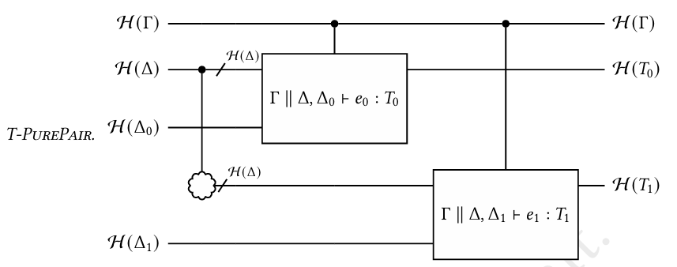

# The Intermediate Representation

This document describes the intermediate representation used in the process of compiling Qunity to low-level quantum circuits. This can be viewed as a simple imperative language that allows registers to be manipulated as variables, and it contains primitives for several Kraus operators and norm non-decreasing superoperators defined in Appendix H.1 of Voichick et al. Because these are taken as primitives, one does not need to consider how to use prep/flag/garbage wires or ancillary qubits to implement these operators in terms of unitaries, because this will automatically be done when the language is converted to low-level circuits.

## Syntax

The intermediate representation is constructed from _operators_. An operator can be (1) a primitive quantum operator from a certain set $\mathcal{O}$. This consists of operators from Appendix H.1 as well as some additional ones used for manipulating registers associated with contexts - for example, `IContextPartition`, parameterized by a context and a set of free variables. Given a register corresponding to this context, this operator outputs a pair of registers corresponding to the subset of the context with variables contained in the set, and the rest of the context. In terms of actual quantum gates, this will be an identity, but this allows us to more easily construct the high-level circuits when Qunity's typing judgements rely on certain subsets of contexts.

(2) It can be a user-defined operator $`\lambda [(x_1, s_1), \dots, (x_l, s_l)] [c_1, \dots, c_m] [(y_1, s'_1), \dots, (y_n, s'_n)]`$, where the $x_i$ and $y_i$ are strings representing argument names and return variable names, respectively, $s_i$ and $s'_i$ are integers representing sizes, and the $c_i$ are commands in the form $`[y_{i,1}, \dots, y_{i,n_i}] \leftarrow o_i [x_{i,1}, \dots, x_{i,l_i}]`$ where $o_i$ is an operator. The commands represent putting some set of registers as inputs to an operator and assigning the output registers to some new variables. Operators correspond to _circuit specifications_, while commands correspond to _circuits_.

An user-defined operator is what will be output when converting any Qunity expression or program to the intermediate representation. When converting an expression with a pure typing judgement $\Gamma || \Delta \vdash e : T$, this operator will take in a register corresponding to the classical context $\Gamma$ and one corresponding to the quantum context $\Delta$ and output one corresponding to the type $T$. Really, the operator is $\mathcal{H}(\Gamma) \otimes \mathcal{H}(\Delta) \rightarrow \mathcal{H}(\Gamma) \otimes \mathcal{H}(T)$, but the $\Gamma$ register is not altered by the operator and is only used for controls of gates. For a mixed typing judgement $\Delta \Vdash e : T$, this just becomes $\mathcal{H}(\Delta) \rightarrow \mathcal{H}(T)$, since there is no classical context. For pure and mixed programs ($T \rightsquigarrow T'$ and $T \Rrightarrow T'$), the operator is $\mathcal{H}(T) \rightarrow \mathcal{H}(T')$.

## Semantics

We can define a function $\mathcal{S}$ that takes in an intemediate representation operator and ouptuts a circuit specification, which is a function taking in a list of registers and a set of used wires and outputting a circuit. For primitive operators in $\mathcal{O}$, we can assume a low-level implementation of the circuit specification exists. Now, for the user-defined operators, we have that,

$$
\frac{\huge {x_1, \dots, x_l \text{ are distinct} \quad y_1, \dots, y_l \text{ are distinct} \quad \mathrm{regsize}(r_i) = s_i \\; \forall i \in \[l\] \quad \mathcal{L}\Big(I(\[r_1, \dots, r_l\], W), \\{x_1 \mapsto r_1, \dots, x_l \mapsto r_l\\}, \[c_1, \dots, c_m\]\Big) = (C, V)} \atop \huge {\mathrm{dom}(V) = \\{y_1, \dots, y_n\\} \quad \mathrm{outregs}(C) = \[r'_1, \dots, r'_n\]} \quad V(y_i) = r'\_{\pi(i)} \\; \forall i \in \[n\] \quad \mathrm{regsize}(r'\_{\pi(i)}) = s'_i \\; \forall i \in \[n\]}
{S\Big(\lambda \[(x_1, s_1), \dots, (x_l, s_l)\] \[c_1, \dots, c_m\] \[(y_1, s'_1), \dots, (y_n, s'_n)\]\Big)(\[r_1, \dots, r_l\], W) = \mathrm{permuteoutregs}(C, \pi)}
$$

where $I$ is the identity circuit acting on the registers $r_1, \dots, r_l$ and outputting the same registers, and $W$ is a set of used wires that is passed into the constructed circuit specification and given to the initial identity circuit (the lower-level operations will then update it accordingly when adding more parts to this circuit). Here, $\pi$ is a permutation that is used because the order of the returned variable names may not be the same as the order of the circuit's output registers. We define $\mathcal{L}$ as acting on a current circuit $C$, a valuation $V$ mapping strings to registers, and a list of commands $\[c_1, \dots, c_m\]$, and outputting a circuit and an updated valuation.

$$
\frac{}
{\mathcal{L}(C, V, \emptyset) = (C, V)}
$$

$$
\frac{\mathcal{L}(C, V, \[c_1, \dots c_{m-1}\]) = (C', V') \quad \mathcal{A}(C', V', Y \leftarrow o X) = (C'', V'')}
{\mathcal{L}(C, V, \[c_1, \dots c_{m-1}, Y \leftarrow o X\]) = (C', V'')}
$$

where we define $\mathcal{A}$ as

$$
\frac{X \subseteq \mathrm{dom}(V) \quad Y \cap (\mathrm{dom}(V) \setminus X) = \emptyset \quad \mathcal{S}(o)(V(X)) = C' \quad \mathrm{outregs}(C') = \[r_1, \dots, r_n\]}
{\mathcal{A}(C, V, \[y_1, \dots, y_n\] \leftarrow o X) = (C'C, (V \setminus V|_{X}) \cup \\{y_1 \mapsto r_1, \dots, y_n \mapsto r_n\\})}
$$

## Example

The following example implements the circuit for T-PUREPAIR using the intermediate representation.


```ocaml
let op0 = compile_pure_expr_to_inter_op g d0 e0 in
let op1 = compile_pure_expr_to_inter_op g d1 e1 in
  inter_lambda
    [("g", gsize); ("d", dsize)]
    [
      inter_letapp ["d01"; "d_xor"] (IContextPartition (d, fv01)) ["d"];
      inter_letapp ["d0*"; "d1*"]
        (IContextPartition (d_xor, fv0))
        ["d_xor"];
      inter_letapp ["d01"; "d01*"] (IContextShare d01) ["d01"];
      inter_letapp ["d01_0"] (IContextMerge (d01, d0')) ["d01"; "d0*"];
      inter_letapp ["d01*_1"]
        (IContextMerge (d01, d1'))
        ["d01*"; "d1*"];
      inter_letapp ["g"; "t0"] op0 ["g"; "d01_0"];
      inter_letapp ["g"; "t1"] op1 ["g"; "d01*_1"];
      inter_letapp ["res"] (IPair (t0, t1)) ["t0"; "t1"];
    ]
    [("g", gsize); ("res", tsize)]
```

Here, `inter_expr_seq`, `inter_letapp`, and `inter_app` are just aliases for `IExprSeq`, `ILetApply` and `IApply`. The first statement in the sequence partitions the input quantum context register into the part shared by both expressions - `"d01"`, or $\Delta$ in the diagram, and `"d_xor"` corresponding to the rest, which is used in exactly one of the Qunity expressions, corresponding to $\Delta_0 \cup \Delta_1$ in the diagram. The second statement partitions that into $\Delta_0$ and $\Delta_1$. The next statement shares the $\Delta$ register into a new register. The next statement merges $\Delta$ and $\Delta_0$ to act as an input to the circuit for $e_0$, and the next statement does the same for $\Delta_1$ and $e_1$, but merging with the new copy of the $\Delta$ register coming from the share gate. Then, the compiled operators for $e_0$ and $e_1$ are applied to the corresponding arguments. Finally, the two outputs are merged into a single register, producing an output in $\mathcal{H}(T_0 \otimes T_1)$. Note that everything here, except for the actual application of $e_0$ and $e_1$, has no actual quantum gates associated with it and just turns into the identity when compiled to the low-level representation.

